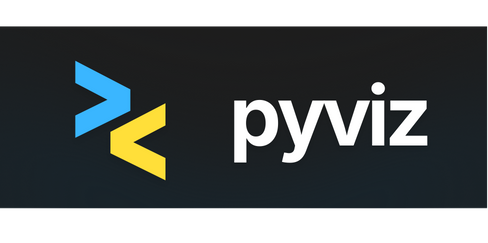
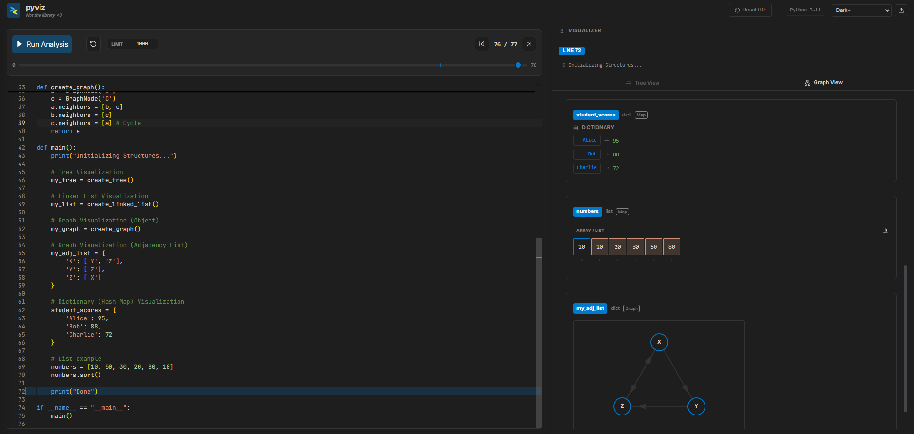

# Pyviz



**Pyviz** is a web-based Python IDE with built-in code visualization capabilities. It allows you to write Python code and see its execution visualized step-by-step, providing a clear understanding of how your data structures change over time.

To check it out, go to [https://asq-pyviz.netlify.app/](https://asq-pyviz.netlify.app/)

## Features



*   **Live Python Execution**: Your Python code is executed directly in the browser using Pyodide (Python compiled to WebAssembly).
*   **Step-by-Step Debugging**: Step forward and backward through your code's execution to see the state of variables at each line.
*   **Rich Data Structure Visualization**: Get a clear, visual representation of your data structures. Supported structures include:
    *   Arrays/Lists: View as a standard list or a bar chart for numeric data.
    *   Linked Lists: See the connections between nodes.
    *   Trees: Visualize binary and generic tree structures.
    *   Graphs: Supports both adjacency list and object-based graph representations.
    *   Hash Maps (Dictionaries): Understand how your key-value pairs are stored.
*   **Interactive Input**: Run programs that require user input via Python's built-in `input()` function.
*   **Modern Code Editor**: A full-featured editing experience with syntax highlighting, powered by Monaco Editor.
*   **Customizable Themes**: Switch between different themes to find the look that suits you best.
*   **Resizable Layout**: Adjust the editor and visualizer panels to your liking.

## Technologies Used

*   **Frontend**: React, TypeScript, Tailwind CSS
*   **Python Execution**: Pyodide
*   **Code Editor**: Monaco Editor
*   **Icons**: Lucide React
*   **Build Tool**: Vite

## Getting Started

1.  Clone the repository:
    ```bash
    git clone https://github.com/asquilatan/pyviz.git
    ```
2.  Install dependencies:
    ```bash
    cd pyviz
    npm install
    ```
3.  Run the development server:
    ```bash
    npm run dev
    ```
4.  Open your browser and navigate to `http://localhost:5173`.

---
*Disclaimer: This project is named Pyviz but is not affiliated with the PyViz.org library.*